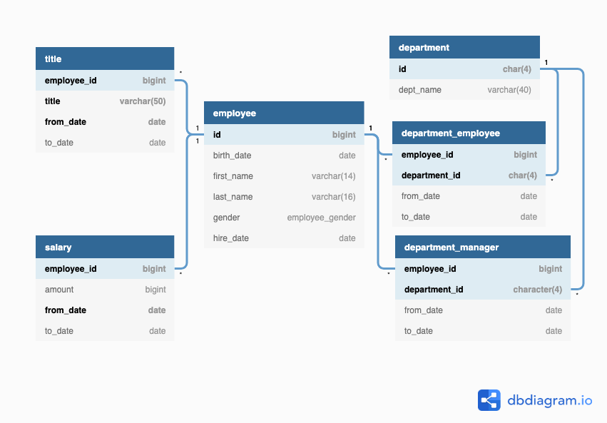

# SQL-Based Exploratory Analysis of HR Data

## 📝 Overview
This project focuses on **HR data exploration and dataset preparation** using SQL Server.  
The analysis pipeline includes **data cleaning → data adjustment with indexed views → employee segmentation → EDA → workforce allocation & management**.  

The main objectives are:
- Ensure dataset integrity through **cleaning and validation**.  
- Adjust dataset to a **realistic timeline** using indexed views.  
- Segment employees into **current vs. former** groups.  
- Conduct **exploratory analysis (EDA)** on employee demographics, salaries, tenure, and promotions.  
- Analyze **workforce allocation, managerial efficiency, and turnover rates**.  

---

## 🗂 Dataset Schema
Entity Relationship Diagram (ERD):  

---

## 🔄 Workflow
1. **Data Cleaning** → Validate, detect anomalies, remove duplicates.  
2. **Data Adjustment & Indexed Views** → Standardize and optimize dataset.  
3. **Employee Segmentation** → Current vs. Former employees.  
4. **Exploratory Data Analysis (EDA)** → Univariate, bivariate, multivariate insights.  
5. **Workforce Allocation & Management** → Analyze workforce balance, tenure, and turnover.  

---

## 📁 Project Files
- `data_cleanning.sql` → Data validation & cleaning.  
- `indexed_views_setup.sql` → Dataset adjustment & indexed views.  
- `employee_status_segmentation.sql` → Employee segmentation queries.  
- `eda.sql` → Exploratory Data Analysis (EDA).  
- `workforce_allocation_management.sql` → Workforce allocation & management analysis.  

---

## 📂 Analysis by File

### 🧹 Data Cleaning (`data_cleanning.sql`)
- **Row Counts** → Identified largest tables.  
- **Data Structure** → Checked schema & relationships.  
- **NULL Values** → None found.  
- **Duplicate Data** → Detected duplicate records in relationship tables.  
- **Time Anomalies** → Overlapping dept assignments, invalid `to_date < from_date`, salaries before hire_date.  
- **Foreign Key Validation** → 24 invalid `employee_id` in `department_manager`.  

---

### 🏗 Data Adjustment & Indexed Views (`indexed_views_setup.sql`)
- **Date Shifting** → Added +22 years to dates for current relevance.  
- **Schema Setup** → Created `mv_employees` schema.  
- **Indexed Views** → Employee, department, manager, salary, title.  
- **Performance Optimization** → Clustered & non-clustered indexes.  

---

### 👥 Employee Segmentation (`employee_status_segmentation.sql`)
- **Current Employees**  
  - ID, demographics, current title, latest salary, current department.  
- **Former Employees**  
  - ID, last title, last salary, last department, exit date.  
  - Excluded employees with active records.  
  - Defaults for missing data (`N/A`, `0`).  

---

### 📊 Exploratory Data Analysis (EDA) (`eda.sql`)
- **Univariate Analysis** → Employee status, gender, age, hiring trend, salaries, titles, departments.  
- **Bivariate Analysis** → Salary by gender, department, tenure, promotion speed.  
- **Multivariate Analysis** → Salary by department & title, salary by age & title, promotion speed by department.  

---

### 🏢 Workforce Allocation & Management (`workforce_allocation_management.sql`)
- **Workforce Structure**  
  - Employees per department.  
  - Employee-to-manager ratio.  
  - Manager coverage.  
- **Insights & Issues**  
  - Unrealistic ratios → missing mid-level managers.  
- **Proposed Solutions**  
  - Add mid-level managers, delegation, efficiency evaluation.  
- **Workforce Balance**  
  - Avg employee tenure: ~13 years.  
  - Avg manager tenure: varies by department.  
  - Turnover: Finance highest (28.57%), Customer Service lowest (25.93%).  
- **Conclusions**  
  - Workforce stable overall, but retention varies by department.  
  - Suggest cultural/benefit improvements and managerial rotation.  

---
